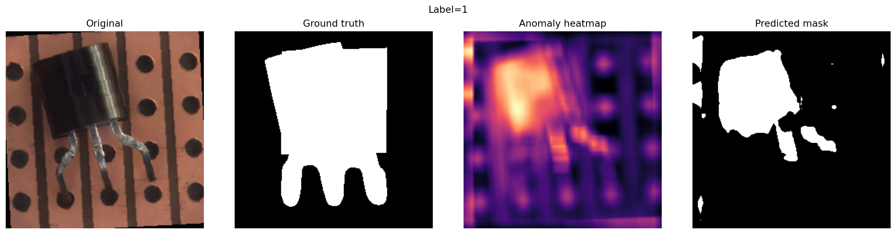

markdown_content = """# Industrial Anomaly Detection: Semiconductor Inspection


## 📌 Overview
This repository implements a production-ready, unsupervised anomaly detection system for semiconductor manufacturing, specifically targeting the **MVTec AD Transistor** dataset. 

In real-world manufacturing environments, defective wafers or chips are exceedingly rare, and comprehensive pixel-level annotations are practically impossible to maintain. Therefore, this project adopts an **unsupervised Anomaly Detection (AD)** paradigm: models are trained *exclusively on normal, healthy images* to detect any structural or textural deviations during inference.

## 🚀 Project Evolution & Architecture

The project systematically explores three paradigms, moving from a standard Deep Learning baseline to a highly optimized, ROI-driven industrial solution.

### 1. Deep Learning Baseline: Convolutional Autoencoder
- **Approach**: Train a CNN autoencoder from scratch to reconstruct healthy transistors. Anomalies are detected via the Mean Squared Error (MSE) of the reconstruction.
- **Outcome**: `AUROC: 0.56`. 
- **Analysis**: The network generalized too well, often perfectly reconstructing small structural defects, leading to a high rate of false negatives. The high computational cost of training did not justify the performance.

### 2. Transfer Learning: Frozen ResNet18 + KNN
- **Approach**: Shift to a zero-training paradigm using an ImageNet-pretrained ResNet18 as a frozen feature extractor. Normal patch embeddings were stored in a memory bank, and a K-Nearest Neighbors (KNN) algorithm was used to score anomalies based on cosine distance.
- **Outcome**: `AUROC: 0.92`.
- **Analysis**: Drastic improvement in image-level detection with zero backpropagation required. However, spatial localization (Pixel Dice) remained weak (~9%) due to lost spatial resolution and internal normalization limits.

### 3. State-of-the-Art Industrial System: PatchCore + Greedy Coreset + Faiss
- **Approach**: Implementation of the PatchCore architecture, heavily optimized for production constraints (low latency, restricted memory).
  - **Backbone**: ResNet50 utilizing multi-scale feature concatenation (Layer 2 + Layer 3) to preserve high-resolution spatial details.
  - **Spatial Smoothing**: Applied 3x3 Average Pooling to incorporate local context and reduce noise.
  - **Greedy K-Center Coreset**: Instead of storing 200,000+ random patches, the system uses a greedy min-max algorithm (with Johnson-Lindenstrauss random projection) to select only the 10,000 most diverse and representative healthy patches.
  - **Faiss Integration**: Replaced standard KNN with Meta's `faiss-cpu` (L2 Index) to ensure microsecond-level inference latency and minimal RAM footprint.
- **Outcome**: `AUROC: 0.965`, `Pixel Dice: ~23%`.
- **Analysis**: State-of-the-art detection accuracy. The Coreset algorithm successfully reduced the memory footprint by 95% while simultaneously eliminating false positives, resulting in a lightweight model perfect for high-speed production lines.

## 📊 Performance Summary

| Model / Approach | Image AUROC | F1-Score | Pixel Dice | Memory Footprint / Training |
|------------------|-------------|----------|------------|-----------------------------|
| Conv Autoencoder | 0.567       | 0.585    | 0.033      | High (Heavy training)       |
| ResNet18 + KNN   | 0.929       | 0.888    | 0.090      | ~50k patches (Random)       |
| **PatchCore (Optimized)** | **0.965** | **0.915**| **0.226** | **10k patches (Coreset)** |

## 👁️ Visual Results

The system successfully generates detailed anomaly heatmaps to locate structural and textural defects on the transistors without relying on supervised masks during training.


*Example of PatchCore localization: Original Image vs Ground Truth Mask vs Predicted Heatmap vs Predicted Mask.*

## 📁 Repository Structure

```text
├── src/
│   └── mvtec_ad/
│       ├── models/
│       │   ├── autoencoder.py    # Baseline AE implementation
│       │   ├── feature_knn.py    # ResNet18 + KNN implementation
│       │   └── patchcore.py      # Production PatchCore with Faiss & Coreset
│       ├── cli.py                # Command-line interface
│       ├── data.py               # Dataloaders and transformations
│       ├── evaluation.py         # Evaluation loops
│       ├── metrics.py            # AUROC, F1, Dice calculation
│       └── visualization.py      # Heatmap generation
├── scripts/                      # Execution wrappers
├── outputs/
│   └── ae_visualizations/        # Automatically generated heatmap results
├── README.md
```

## 🛠️ Installation & Usage

### Prerequisites
```bash
pip install torch torchvision faiss-cpu scikit-learn matplotlib tqdm
```

Running the System

The project is built with a modular CLI. To run the optimized PatchCore pipeline:

```bash
python -m mvtec_ad.cli patchcore \\
    --data-root /path/to/mvtec_transistor \\
    --cpu \\
    --num-workers 0 \\
    --batch-size 1 \\
    --image-size 256 \\
    --max-memory-patches 10000
```
(Note: --num-workers 0 and Faiss thread limiting are used to guarantee stability on Windows machines with constrained shared memory).

> ⚠️ **Windows Users Note**
> If you are running this on a Windows machine with constrained RAM or limited shared memory, the `--num-workers 0` flag is **crucial** to prevent PyTorch `shm.dll` multiprocessing crashes. 
> Additionally, the `patchcore.py` module automatically restricts `faiss` to a single thread (`faiss.omp_set_num_threads(1)`) to avoid OpenBLAS memory allocation failures.

## 👨‍💻 Author

**AIT LASRI Anass**
* Data Scientist / AI Engineer
* [LinkedIn](https://www.linkedin.com/in/anass-ait-lasri/) | [GitHub](https://github.com/anassaitlasri)

*This project was developed to demonstrate industrial-grade computer vision and anomaly detection capabilities, specifically tailored for semiconductor manufacturing constraints.*

---
⚖️ Attribution & License
Attribution

If you use the dataset in scientific work, please cite:

    Paul Bergmann, Michael Fauser, David Sattlegger, and Carsten Steger,
    "A Comprehensive Real-World Dataset for Unsupervised Anomaly Detection",
    IEEE Conference on Computer Vision and Pattern Recognition, 2019

License

Copyright 2019 MVTec Software GmbH

This work is licensed under a Creative Commons Attribution-NonCommercial-ShareAlike 4.0 International License.

You should have received a copy of the license along with this work.
If not, see http://creativecommons.org/licenses/by-nc-sa/4.0/.

For using the data in a way that falls under the commercial use clause of the license, please contact us.


Contact

If you have any questions or comments about the dataset, feel free to contact us via: paul.bergmann@mvtec.com, fauser@mvtec.com, sattlegger@mvtec.com, steger@mvtec.com
"""

with open("README.md", "w", encoding="utf-8") as f:
f.write(markdown_content)

print("[file-tag: code-generated-file-readme-md]")